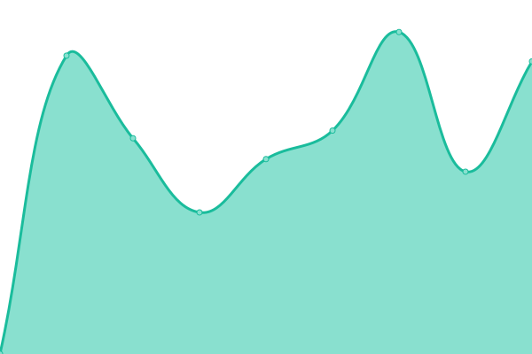

# [📈 Live Status](https://clye-app.github.io/uptime): <!--live status--> **Alle Systems sind bereit**

This repository contains the open-source uptime monitor and status page for [CLYE GmbH](https://clye.app), powered by [Upptime](https://github.com/upptime/upptime).

With [Upptime](https://upptime.js.org), you can get your own unlimited and free uptime monitor and status page, powered entirely by a GitHub repository. We use [Issues](https://github.com/clye-app/uptime/issues) as incident reports, [Actions](https://github.com/clye-app/uptime/actions) as uptime monitors, and [Pages](https://clye-app.github.io/uptime) for the status page.

<!--start: status pages-->
<!-- This summary is generated by Upptime (https://github.com/upptime/upptime) -->
<!-- Do not edit this manually, your changes will be overwritten -->
<!-- prettier-ignore -->
| URL | Status | History | Response Time | Uptime |
| --- | ------ | ------- | ------------- | ------ |
|  [Clye.app](https://clye.app) | Up | [clye-app.yml](https://github.com/clye-app/uptime/commits/HEAD/history/clye-app.yml) | 

 1295ms
     
 | 

<a href="https://clye-app.github.io/uptime/history/clye-app">100.00%</a>
    

|  [Bot](https://bot.clye.app) | Up | [bot.yml](https://github.com/clye-app/uptime/commits/HEAD/history/bot.yml) | 

 771ms
     
 | 

<a href="https://clye-app.github.io/uptime/history/bot">100.00%</a>
    

|  [LegalBFF](https://legalbff.de) | Up | [legal-bff.yml](https://github.com/clye-app/uptime/commits/HEAD/history/legal-bff.yml) | 

 1035ms
     
 | 

<a href="https://clye-app.github.io/uptime/history/legal-bff">100.00%</a>
    

|  [AI-Hub Kaiser](https://ai-hub.kaiser.bluetomato.tech) | Up | [ai-hub-kaiser.yml](https://github.com/clye-app/uptime/commits/HEAD/history/ai-hub-kaiser.yml) | 

 1609ms
     
 | 

<a href="https://clye-app.github.io/uptime/history/ai-hub-kaiser">99.54%</a>
    

<!--end: status pages-->

[**Visit our status website →**](https://clye-app.github.io/uptime)

## 📄 License

- Powered by: [Upptime](https://github.com/upptime/upptime)
- Code: [MIT](./LICENSE) © [Anand Chowdhary](https://anandchowdhary.com), supported by [Pabio](https://pabio.com)
- Data in the `./history` directory: [Open Database License](https://opendatacommons.org/licenses/odbl/1-0/)
